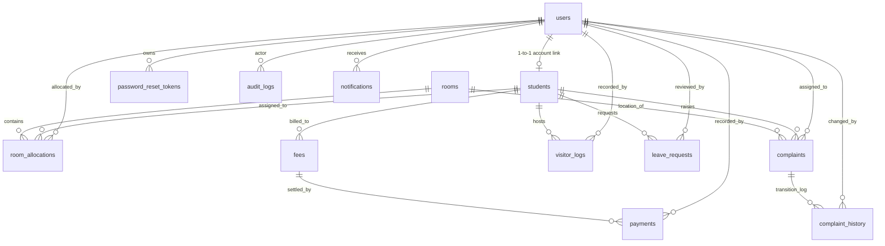

# Authoritative Database Schema Documentation

This document describes the database schema, table structures, relationships, indexes, constraints, role values, and status values for the **Hostel Management System**.

- **Database Engine**: MySQL 8.0+ (InnoDB)
- **Character Set**: `utf8mb4`
- **Collation**: `utf8mb4_unicode_ci`
- **Database Name**: `hostel_management`
- **Timezone**: UTC (`+00:00`)

---

## 1. Schema Entity-Relationship Overview

---

## 2. Comprehensive Table Specifications

### 2.1 `users`
System user accounts for all roles. Passwords are encrypted with bcrypt (`10` salt rounds).

| Column | Type | Nullable | Constraints & Defaults | Description |
| :--- | :--- | :--- | :--- | :--- |
| `id` | BIGINT UNSIGNED | No | PK, AUTO_INCREMENT | Unique user identifier |
| `username` | VARCHAR(50) | No | UNIQUE | User login handle |
| `email` | VARCHAR(255) | No | UNIQUE | User contact email |
| `password` | VARCHAR(255) | No | | Bcrypt password hash |
| `full_name` | VARCHAR(150) | No | | Display name |
| `role` | ENUM | No | `'ADMIN','WARDEN','STUDENT','MAINTENANCE'` | System RBAC role |
| `is_active` | TINYINT(1) | No | DEFAULT 1 | 1 = Active, 0 = Disabled |
| `created_at` | DATETIME | No | DEFAULT CURRENT_TIMESTAMP | Account creation time |
| `updated_at` | DATETIME | No | ON UPDATE CURRENT_TIMESTAMP | Last update timestamp |
| `last_login_at`| DATETIME | Yes | DEFAULT NULL | Timestamp of last login |

---

### 2.2 `password_reset_tokens`
Time-limited, single-use reset tokens. Raw token is never stored; only its SHA-256 hash is persisted.

| Column | Type | Nullable | Constraints & Defaults | Description |
| :--- | :--- | :--- | :--- | :--- |
| `id` | BIGINT UNSIGNED | No | PK, AUTO_INCREMENT | Primary key |
| `user_id` | BIGINT UNSIGNED | No | FK → `users(id)` ON DELETE CASCADE | Associated user account |
| `token_hash` | VARCHAR(255) | No | UNIQUE | SHA-256 hash of raw token |
| `expires_at` | DATETIME | No | | Token expiry (1 hour after issue) |
| `used_at` | DATETIME | Yes | DEFAULT NULL | Timestamp when consumed |
| `created_at` | DATETIME | No | DEFAULT CURRENT_TIMESTAMP | Token generation time |

---

### 2.3 `audit_logs`
Immutable compliance audit trail. Does not cascade on user deletion (`ON DELETE SET NULL`) so audit records survive account removal.

| Column | Type | Nullable | Constraints & Defaults | Description |
| :--- | :--- | :--- | :--- | :--- |
| `id` | BIGINT UNSIGNED | No | PK, AUTO_INCREMENT | Primary key |
| `actor_user_id` | BIGINT UNSIGNED | Yes | FK → `users(id)` ON DELETE SET NULL | User who initiated action |
| `action` | VARCHAR(100) | No | | Event code (e.g. `LOGIN`, `PAYMENT_RECORDED`) |
| `entity_type` | VARCHAR(100) | Yes | | Domain entity (`student`, `fee`, `leave`, etc.) |
| `entity_id` | BIGINT UNSIGNED | Yes | | Target record identifier |
| `details` | JSON | Yes | | Safe contextual payload (no secrets) |
| `ip_address` | VARCHAR(45) | Yes | | Client IPv4 or IPv6 address |
| `user_agent` | VARCHAR(512) | Yes | | Client browser user agent |
| `created_at` | DATETIME | No | DEFAULT CURRENT_TIMESTAMP | Immutable event timestamp |

---

### 2.4 `students`
Student demographic profiles linked 1-to-1 with a `STUDENT` user account.

| Column | Type | Nullable | Constraints & Defaults | Description |
| :--- | :--- | :--- | :--- | :--- |
| `id` | BIGINT UNSIGNED | No | PK, AUTO_INCREMENT | Primary key |
| `user_id` | BIGINT UNSIGNED | No | UNIQUE, FK → `users(id)` ON DELETE RESTRICT | Associated login account |
| `student_id` | VARCHAR(50) | No | UNIQUE | Institutional roll/registration number |
| `full_name` | VARCHAR(150) | No | | Student full name |
| `gender` | ENUM | No | `'MALE','FEMALE','OTHER'` | Gender category |
| `contact_number`| VARCHAR(20) | No | | Emergency / personal phone |
| `address` | TEXT | No | | Permanent postal address |
| `department` | VARCHAR(100) | No | | Academic program/department |
| `admission_date`| DATE | No | | Date enrolled in residence |
| `is_active` | TINYINT(1) | No | DEFAULT 1 | Active residency flag |
| `created_at` | DATETIME | No | DEFAULT CURRENT_TIMESTAMP | Profile creation time |
| `updated_at` | DATETIME | No | ON UPDATE CURRENT_TIMESTAMP | Last profile update |

---

### 2.5 `rooms`
Hostel room inventory and physical bed capacities.

| Column | Type | Nullable | Constraints & Defaults | Description |
| :--- | :--- | :--- | :--- | :--- |
| `id` | BIGINT UNSIGNED | No | PK, AUTO_INCREMENT | Primary key |
| `room_number` | VARCHAR(20) | No | UNIQUE | Unique room designation (e.g., `101`, `204-A`) |
| `block` | VARCHAR(50) | No | | Hostel wing/building |
| `floor` | INT | No | | Floor number |
| `room_type` | ENUM | No | `'SINGLE','DOUBLE','TRIPLE','DORMITORY'` | Room capacity classification |
| `capacity` | INT | No | | Maximum allowed beds/occupants |
| `created_at` | DATETIME | No | DEFAULT CURRENT_TIMESTAMP | Room creation time |
| `updated_at` | DATETIME | No | ON UPDATE CURRENT_TIMESTAMP | Last room modification |

---

### 2.6 `room_allocations`
Student bed allocations. An allocation is active if `vacated_at IS NULL`.

| Column | Type | Nullable | Constraints & Defaults | Description |
| :--- | :--- | :--- | :--- | :--- |
| `id` | BIGINT UNSIGNED | No | PK, AUTO_INCREMENT | Primary key |
| `student_id` | BIGINT UNSIGNED | No | FK → `students(id)` ON DELETE RESTRICT | Allocated student |
| `room_id` | BIGINT UNSIGNED | No | FK → `rooms(id)` ON DELETE RESTRICT | Target room |
| `allocated_at` | DATETIME | No | DEFAULT CURRENT_TIMESTAMP | Allocation assignment date |
| `vacated_at` | DATETIME | Yes | DEFAULT NULL | Departure date (NULL if active) |
| `allocated_by` | BIGINT UNSIGNED | No | FK → `users(id)` ON DELETE RESTRICT | Staff member who assigned bed |
| `created_at` | DATETIME | No | DEFAULT CURRENT_TIMESTAMP | Allocation creation time |

---

### 2.7 `fees`
Semester fee assessments.

| Column | Type | Nullable | Constraints & Defaults | Description |
| :--- | :--- | :--- | :--- | :--- |
| `id` | BIGINT UNSIGNED | No | PK, AUTO_INCREMENT | Primary key |
| `student_id` | BIGINT UNSIGNED | No | FK → `students(id)` ON DELETE RESTRICT | Billed student |
| `fee_type` | VARCHAR(100) | No | | Fee item (e.g., `Hostel Rent`, `Mess Fee`) |
| `academic_period`| VARCHAR(50) | No | | Term (e.g., `Fall 2026`, `Spring 2027`) |
| `amount` | DECIMAL(10,2)| No | | Total amount assessed |
| `due_date` | DATE | No | | Payment deadline |
| `created_at` | DATETIME | No | DEFAULT CURRENT_TIMESTAMP | Fee invoice creation time |
| `updated_at` | DATETIME | No | ON UPDATE CURRENT_TIMESTAMP | Last fee modification |
| *(Composite)* | UNIQUE | No | `(student_id, fee_type, academic_period)` | Prevents duplicate billing |

---

### 2.8 `payments`
Recorded payments linked to specific fee assessments.

| Column | Type | Nullable | Constraints & Defaults | Description |
| :--- | :--- | :--- | :--- | :--- |
| `id` | BIGINT UNSIGNED | No | PK, AUTO_INCREMENT | Primary key |
| `fee_id` | BIGINT UNSIGNED | No | FK → `fees(id)` ON DELETE RESTRICT | Target fee record |
| `receipt_number`| VARCHAR(50) | No | UNIQUE | Generated code (`RCPT-YYYYMMDD-HEX`) |
| `amount` | DECIMAL(10,2)| No | | Payment amount |
| `payment_method`| ENUM | No | `'CASH','BANK_TRANSFER','UPI','OTHER'` | Payment rail |
| `transaction_reference`| VARCHAR(255)| Yes | DEFAULT NULL | Bank or UPI reference |
| `paid_at` | DATETIME | No | DEFAULT CURRENT_TIMESTAMP | Settlement timestamp |
| `recorded_by` | BIGINT UNSIGNED | No | FK → `users(id)` ON DELETE RESTRICT | Cashier / staff user |
| `notes` | TEXT | Yes | DEFAULT NULL | Optional clerk notes |
| `created_at` | DATETIME | No | DEFAULT CURRENT_TIMESTAMP | Payment entry timestamp |

---

### 2.9 `complaints`
Operational maintenance work orders.

| Column | Type | Nullable | Constraints & Defaults | Description |
| :--- | :--- | :--- | :--- | :--- |
| `id` | BIGINT UNSIGNED | No | PK, AUTO_INCREMENT | Primary key |
| `ticket_id` | VARCHAR(50) | No | UNIQUE | Ticket tracking number (`CMP-YYYYMMDD-HEX`)|
| `student_id` | BIGINT UNSIGNED | No | FK → `students(id)` ON DELETE RESTRICT | Student who logged complaint |
| `room_id` | BIGINT UNSIGNED | No | FK → `rooms(id)` ON DELETE RESTRICT | Room where repair is needed |
| `category` | ENUM | No | `'ELECTRICAL','PLUMBING','CARPENTRY','CLEANING','FURNITURE','WATER','INTERNET','ROOM','OTHER'` | Fault type |
| `description` | TEXT | No | | Detailed problem description |
| `priority` | ENUM | No | `'LOW','MEDIUM','HIGH','URGENT'`, DEFAULT `'MEDIUM'` | Urgency level |
| `status` | ENUM | No | `'SUBMITTED','ASSIGNED','IN_PROGRESS','RESOLVED','CLOSED'`, DEFAULT `'SUBMITTED'` | Lifecycle state |
| `assigned_to` | BIGINT UNSIGNED | Yes | FK → `users(id)` ON DELETE SET NULL | Assigned technician |
| `created_at` | DATETIME | No | DEFAULT CURRENT_TIMESTAMP | Ticket submission time |
| `updated_at` | DATETIME | No | ON UPDATE CURRENT_TIMESTAMP | Last modification time |
| `resolved_at` | DATETIME | Yes | DEFAULT NULL | Repair completion time |
| `closed_at` | DATETIME | Yes | DEFAULT NULL | Administrative closure time |

---

### 2.10 `complaint_history`
Immutable log of work order status transitions and mandatory resolution work notes.

| Column | Type | Nullable | Constraints & Defaults | Description |
| :--- | :--- | :--- | :--- | :--- |
| `id` | BIGINT UNSIGNED | No | PK, AUTO_INCREMENT | Primary key |
| `complaint_id` | BIGINT UNSIGNED | No | FK → `complaints(id)` ON DELETE CASCADE | Associated ticket |
| `changed_by` | BIGINT UNSIGNED | No | FK → `users(id)` ON DELETE RESTRICT | User performing transition |
| `from_status` | ENUM | Yes | Same status enum values | Previous status |
| `to_status` | ENUM | No | Same status enum values | New status |
| `work_notes` | TEXT | Yes | | Required on transition to `RESOLVED` |
| `created_at` | DATETIME | No | DEFAULT CURRENT_TIMESTAMP | Event timestamp |

---

### 2.11 `visitor_logs`
Visitor campus check-in and check-out logs.

| Column | Type | Nullable | Constraints & Defaults | Description |
| :--- | :--- | :--- | :--- | :--- |
| `id` | BIGINT UNSIGNED | No | PK, AUTO_INCREMENT | Primary key |
| `visitor_name` | VARCHAR(150) | No | | Full name of visitor |
| `phone` | VARCHAR(20) | No | | Visitor contact phone |
| `student_id` | BIGINT UNSIGNED | No | FK → `students(id)` ON DELETE RESTRICT | Hosted resident student |
| `purpose` | VARCHAR(255) | No | | Reason for visit |
| `entry_at` | DATETIME | No | DEFAULT CURRENT_TIMESTAMP | Check-in timestamp |
| `exit_at` | DATETIME | Yes | DEFAULT NULL | Check-out timestamp (NULL = active) |
| `recorded_by` | BIGINT UNSIGNED | No | FK → `users(id)` ON DELETE RESTRICT | Gate officer user |
| `notes` | TEXT | Yes | DEFAULT NULL | Optional gate notes |
| `created_at` | DATETIME | No | DEFAULT CURRENT_TIMESTAMP | Entry record creation |
| `updated_at` | DATETIME | No | ON UPDATE CURRENT_TIMESTAMP | Last record modification |

---

### 2.12 `leave_requests`
Student off-campus leave applications and digital gate passes.

| Column | Type | Nullable | Constraints & Defaults | Description |
| :--- | :--- | :--- | :--- | :--- |
| `id` | BIGINT UNSIGNED | No | PK, AUTO_INCREMENT | Primary key |
| `student_id` | BIGINT UNSIGNED | No | FK → `students(id)` ON DELETE RESTRICT | Resident applicant |
| `from_datetime` | DATETIME | No | | Departure datetime |
| `to_datetime` | DATETIME | No | | Expected return datetime |
| `reason` | TEXT | No | | Reason for absence |
| `status` | ENUM | No | `'PENDING','APPROVED','REJECTED','CANCELLED','COMPLETED'`, DEFAULT `'PENDING'` | Application state |
| `review_notes` | TEXT | Yes | DEFAULT NULL | Mandatory on `REJECTED` |
| `reviewed_by` | BIGINT UNSIGNED | Yes | FK → `users(id)` ON DELETE SET NULL | Reviewing warden |
| `reviewed_at` | DATETIME | Yes | DEFAULT NULL | Timestamp of warden decision |
| `gate_pass_number`| VARCHAR(50)| Yes | UNIQUE, DEFAULT NULL | Collision-safe code (`GP-YYYY-XXXXXX`) |
| `created_at` | DATETIME | No | DEFAULT CURRENT_TIMESTAMP | Application submission time |
| `updated_at` | DATETIME | No | ON UPDATE CURRENT_TIMESTAMP | Decision / update timestamp |

---

### 2.13 `notifications`
In-app user notifications.

| Column | Type | Nullable | Constraints & Defaults | Description |
| :--- | :--- | :--- | :--- | :--- |
| `id` | BIGINT UNSIGNED | No | PK, AUTO_INCREMENT | Primary key |
| `user_id` | BIGINT UNSIGNED | No | FK → `users(id)` ON DELETE CASCADE | Recipient user |
| `type` | VARCHAR(50) | No | | Alert type (e.g. `LEAVE`, `COMPLAINT`) |
| `title` | VARCHAR(200) | No | | Brief notification title |
| `message` | TEXT | No | | Message body |
| `reference_type`| VARCHAR(50) | Yes | | Target entity type |
| `reference_id` | BIGINT UNSIGNED | Yes | | Target entity ID |
| `is_read` | TINYINT(1) | No | DEFAULT 0 | 0 = Unread, 1 = Read |
| `created_at` | DATETIME | No | DEFAULT CURRENT_TIMESTAMP | Delivery timestamp |

---

## 3. Performance Composite Indexes (`sql/04_final_hardening.sql`)

| Index Name | Table | Columns | Optimized Operations |
| :--- | :--- | :--- | :--- |
| `idx_allocations_student_vacated` | `room_allocations` | `(student_id, vacated_at)` | Active room check (`WHERE student_id = ? AND vacated_at IS NULL`) |
| `idx_allocations_room_vacated` | `room_allocations` | `(room_id, vacated_at)` | Room occupancy count (`WHERE room_id = ? AND vacated_at IS NULL`) |
| `idx_fees_student_due_date` | `fees` | `(student_id, due_date)` | Student fee balance and upcoming due date lookups |
| `idx_payments_fee_paid_at` | `payments` | `(fee_id, paid_at)` | Fee settlement sum and payment timeline |
| `idx_complaints_student_status` | `complaints` | `(student_id, status)` | Filter complaints by student and status |
| `idx_complaints_assigned_status` | `complaints` | `(assigned_to, status)` | Maintenance technician task queue (`/api/my-tasks`) |
| `idx_vl_student_entry` | `visitor_logs` | `(student_id, entry_at)` | Active visitor checks and student visitor history |
| `idx_lr_student_status` | `leave_requests` | `(student_id, status)` | Student leave status filter and warden pending reviews |
| `idx_notif_user_read_created` | `notifications` | `(user_id, is_read, created_at)`| Unread badge counter & chronologically ordered notification feed |
| `idx_al_actor_created` | `audit_logs` | `(actor_user_id, created_at)` | Audit log filtering by actor and date range |
