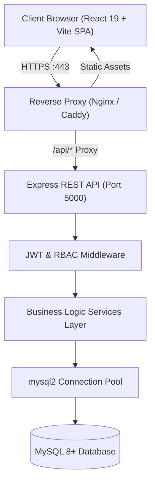
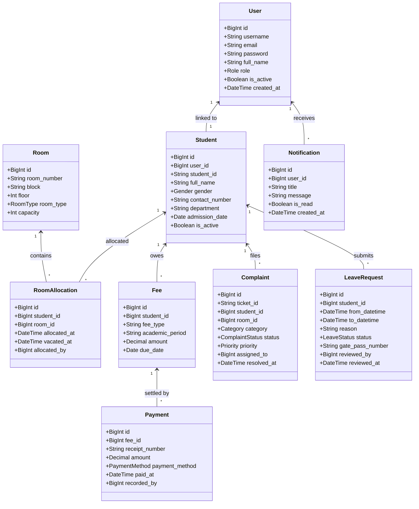
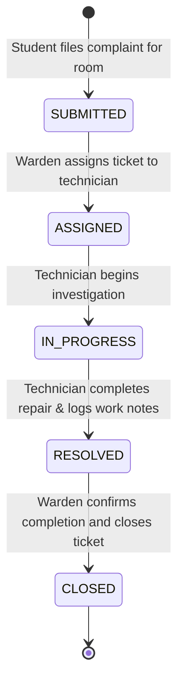
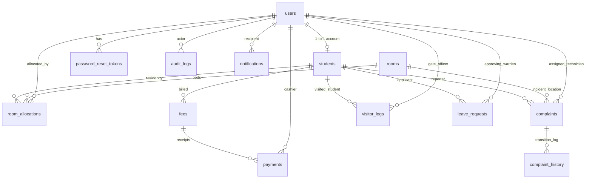

# Software Requirements Specification (SRS)
## Hostel Management System

**Document Version:** 1.0.0  
**Status:** Approved / Final Implementation  
**Repository:** https://github.com/Meikandaar45/hostelManagement  
**System Architecture:** Multi-tier React SPA + Express REST API + MySQL 8+  

---

## Table of Contents
1. [Introduction](#1-introduction)
2. [Problem Statement & Objectives](#2-problem-statement--objectives)
3. [Scope of the System](#3-scope-of-the-system)
4. [User Roles & Personas](#4-user-roles--personas)
5. [System Requirements & Technology Stack](#5-system-requirements--technology-stack)
6. [Functional Requirements](#6-functional-requirements)
7. [Non-Functional Requirements](#7-non-functional-requirements)
8. [UML Diagrams](#8-uml-diagrams)
   - 8.1 System Architecture Diagram
   - 8.2 Use Case Diagram
   - 8.3 Class Diagram
   - 8.4 Sequence Diagram (Leave Approval & Gate Pass)
   - 8.5 Activity Diagram (Complaint Resolution Lifecycle)
   - 8.6 Entity Relationship (ER) Diagram
9. [Verification & Traceability Matrix](#9-verification--traceability-matrix)

---

## 1. Introduction

### 1.1 Purpose
This Software Requirements Specification (SRS) document provides a formal, comprehensive description of the **Hostel Management System**. It specifies the functional requirements, operational workflows, performance parameters, security boundaries, and data architecture governing residence hall operations for higher education institutions.

### 1.2 System Overview
The Hostel Management System is a unified web-based platform engineered to automate campus residence administration. It streamlines bed occupancy, student registration, fee assessments, payment receipts, facility maintenance work orders, visitor gate logs, emergency leave requests, official digital gate passes, and multi-dimensional operational reporting.

---

## 2. Problem Statement & Objectives

### 2.1 Problem Statement
Traditional hostel operations rely heavily on decentralized paper logs, manual ledgers, and verbal requests. This results in:
- Inaccurate occupancy tracking and unintentional over-allocation of room capacities.
- Unreconciled fee balances, untracked cash receipts, and lack of audit trails.
- Slow complaint resolution due to missing technician assignment pipelines.
- Security vulnerabilities in visitor sign-ins and unauthorized student leaves.
- High administrative overhead compiling monthly occupancy, financial, and SLA reports.

### 2.2 Core Objectives
1. **Single Source of Truth**: Centralize student profiles, room allocations, and fee ledgers in an ACID-compliant MySQL database.
2. **Deterministic Role-Based Access Control**: Enforce strict data isolation between Administrators, Wardens, Maintenance Staff, and Students.
3. **Automated Maintenance Workflow**: Provide a state-machine driven work order lifecycle with mandatory technician resolution work notes.
4. **Digital Security & Gate Pass Issuance**: Replace paper exit slips with cryptographically traceable digital gate passes (`GP-YYYY-XXXXXX`) issued automatically upon warden approval.
5. **Immutable Compliance Auditing**: Automatically log every sensitive state change (logins, payments, allocations, status transitions) into an unalterable audit ledger.

---

## 3. Scope of the System

The system encompasses four primary operational domains:
1. **Identity & Governance**: Authentication, password resets, role provisioning, and audit trails.
2. **Residency & Asset Management**: Student roster, room configurations, capacity validation, and bed allocation/vacate lifecycles.
3. **Financial Accounting**: Semester fee generation, payment collection, partial settlement, and printable receipts.
4. **Daily Hostel Operations**: Maintenance tickets, visitor check-in/out, leave approvals, gate passes, user notifications, and multi-format reports.

---

## 4. User Roles & Personas

The system strictly recognizes four roles defined in the authentication token:

| Role | Description | Access Scope |
| :--- | :--- | :--- |
| **`ADMIN`** | Chief Systems Administrator / Campus Director | Global access: user account provisioning, system configuration, audit inspection, financial reporting, and operational overrides. |
| **`WARDEN`** | Residence Manager / Floor Warden | Operational supervision: room allocations, student roster, fee monitoring, complaint assignment, visitor tracking, leave approvals, and operational reports. |
| **`STUDENT`** | Enrolled Resident Student | Self-service access: personal room view, fee balances, payment receipts, maintenance requests for assigned room, leave applications, digital gate pass, and notifications. |
| **`MAINTENANCE`** | Facilities Technician (Electrician, Plumber, etc.) | Dedicated technician portal (`/app/my-tasks`): view assigned work orders, update task progress, and submit mandatory resolution work notes. |

---

## 5. System Requirements & Technology Stack

### 5.1 Technology Stack
- **Frontend Presentation Layer**: React 19, TypeScript, Vite, Tailwind CSS, Lucide React, React Hook Form, Zod.
- **Application & API Gateway**: Node.js, Express, TypeScript, Zod, Helmet, CORS, Cookie-Parser, Express-Rate-Limit.
- **Authentication & Cryptography**: JSON Web Tokens (JWT) signed via HMAC SHA-256, stored in `HttpOnly`, `SameSite=Lax` cookies; passwords hashed with bcrypt (`10` salt rounds).
- **Data Persistence**: MySQL 8.0+ using InnoDB engine, `utf8mb4` character set, and `mysql2/promise` connection pool.
- **Testing & Verification**: Vitest (153 unit/integration tests) and Playwright (33 end-to-end browser tests).

---

## 6. Functional Requirements

### 6.1 Authentication & User Management (FR-AUTH)
- **FR-AUTH-1**: The system shall provide an initial setup endpoint (`/setup`) to bootstrap the first administrator if no users exist.
- **FR-AUTH-2**: Users shall authenticate using username/email and password. Upon successful validation, the system issues an `HttpOnly`, secure JWT cookie.
- **FR-AUTH-3**: The system shall enforce rate-limiting on login and password reset routes (max 20 requests per 15-minute window per IP).
- **FR-AUTH-4**: Passwords shall be hashed using bcrypt before persistence. Raw passwords shall never be logged or stored.
- **FR-AUTH-5**: Administrators shall be capable of creating, updating, activating, and deactivating user accounts.

### 6.2 Student Registry (FR-STUDENT)
- **FR-STUDENT-1**: Wardens and Administrators shall register students with full name, unique student ID, department, contact info, gender, and admission date.
- **FR-STUDENT-2**: Student registration shall automatically create a corresponding `STUDENT` user account.
- **FR-STUDENT-3**: Students shall be restricted to viewing only their own profile data via `/api/me/profile`.

### 6.3 Room Inventory & Allocation (FR-ROOM)
- **FR-ROOM-1**: Rooms shall have a unique room number, block, floor, room type (`SINGLE`, `DOUBLE`, `TRIPLE`, `DORMITORY`), and maximum capacity.
- **FR-ROOM-2**: Allocating a student to a room shall check active occupancy and reject allocations exceeding capacity.
- **FR-ROOM-3**: A student cannot hold more than one active room allocation simultaneously.
- **FR-ROOM-4**: Vacating an allocation shall record `vacated_at = CURRENT_TIMESTAMP`, immediately releasing room capacity.

### 6.4 Fee Structure & Payment Processing (FR-FEE)
- **FR-FEE-1**: Fees shall be assessed to students by academic period and fee type (e.g. Hostels, Amenities, Mess).
- **FR-FEE-2**: The system shall dynamically compute balance as `Total Fee Amount - Total Payments Recorded`.
- **FR-FEE-3**: Recording a payment shall enforce that the payment amount does not exceed the remaining balance.
- **FR-FEE-4**: Every payment generates an immutable receipt with a unique code (`RCPT-YYYYMMDD-XXXX`). Printable receipt views shall be accessible to the payer and administrators.

### 6.5 Complaint & Work Order Management (FR-COMPLAINT)
- **FR-COMPLAINT-1**: Students can log complaints categorized by issue type (Electrical, Plumbing, Internet, etc.) for their active room.
- **FR-COMPLAINT-2**: Complaints follow a strict state progression: `SUBMITTED` → `ASSIGNED` → `IN_PROGRESS` → `RESOLVED` → `CLOSED`.
- **FR-COMPLAINT-3**: Marking a complaint as `RESOLVED` strictly requires non-empty resolution work notes.
- **FR-COMPLAINT-4**: Every status transition shall create an immutable record in `complaint_history` capturing the actor, previous status, next status, and timestamp.
- **FR-COMPLAINT-5**: Technicians access their queue via `/api/my-tasks` which returns only tasks assigned to their user ID.

### 6.6 Visitor Management (FR-VISITOR)
- **FR-VISITOR-1**: Wardens record visitor arrivals with visitor name, phone number, host student ID, and visit purpose.
- **FR-VISITOR-2**: When visitors depart, wardens record the checkout timestamp (`exit_at`).
- **FR-VISITOR-3**: Active visitors on campus are highlighted and filterable in the security log.

### 6.7 Leave Approval & Digital Gate Pass (FR-LEAVE)
- **FR-LEAVE-1**: Students submit leave requests with departure datetime, return datetime, and reason.
- **FR-LEAVE-2**: Departure datetime must be strictly before return datetime.
- **FR-LEAVE-3**: Wardens inspect pending requests and either approve or reject them.
- **FR-LEAVE-4**: Rejections strictly require review notes explaining the cause.
- **FR-LEAVE-5**: Upon approval, the system atomically updates status to `APPROVED`, records reviewer ID and review time, generates a unique Gate Pass code (`GP-YYYY-XXXXXX`), emits a transactional audit log, and notifies the student.
- **FR-LEAVE-6**: Students view and print the official digital gate pass with verification details and QR code representation.

### 6.8 In-App Notifications (FR-NOTIF)
- **FR-NOTIF-1**: The system emits user notifications on important events (leave approved/rejected, complaint assigned/resolved, fee generated).
- **FR-NOTIF-2**: The navigation header displays an unread counter badge that updates dynamically.
- **FR-NOTIF-3**: Users can mark individual notifications or all notifications as read.

### 6.9 Reporting & Dashboards (FR-REPORT)
- **FR-REPORT-1**: The system provides role-tailored dashboards with real-time summary statistics for Admin, Warden, Student, and Maintenance roles.
- **FR-REPORT-2**: The reporting engine provides filtered tabular reports across 7 domains: Students, Rooms, Fees, Payments, Complaints, Leave Requests, and Visitors.
- **FR-REPORT-3**: Reports support browser-side RFC 4180 CSV export and responsive `@media print` print layouts.

### 6.10 System Audit Logging (FR-AUDIT)
- **FR-AUDIT-1**: All critical actions (logins, creates, status updates, deletions) emit structured records to `audit_logs`.
- **FR-AUDIT-2**: Audit log records survive user deletion (`ON DELETE SET NULL`).
- **FR-AUDIT-3**: Administrators can search, filter, and inspect audit logs with actor and date filters.

---

## 7. Non-Functional Requirements

### 7.1 Security & Protection
- Passwords hashed with bcrypt; salts generated per user.
- JWT session tokens stored exclusively in `HttpOnly`, `SameSite=Lax` cookies to prevent XSS exfiltration.
- Insecure Direct Object Reference (IDOR) protections: student and maintenance queries enforce server-side ownership filters.
- Helmet security headers and strict CORS origin validation.

### 7.2 Performance & Scalability
- Composite indexes installed across 8 operational tables to optimize frequent queries.
- Zero-downtime hot backups supported using InnoDB `--single-transaction`.
- Database connection pooling via `mysql2/promise` with automatic keep-alive.
- Debounced search queries on frontend to prevent keystroke request flooding.

### 7.3 Accessibility (a11y) & Usability
- Form controls include descriptive labels and `aria-invalid` bindings.
- Modals implement `role="dialog"`, `aria-modal="true"`, and accessible close buttons.
- Responsive layout adapting smoothly to Desktop (1280px+), Tablet (768px), and Mobile (375px) viewports.

---

## 8. UML Diagrams

### 8.1 System Architecture Diagram

### 8.2 Use Case Diagram

```mermaid
graph TD
    subgraph Actors
        Admin((Administrator))
        Warden((Warden))
        Student((Student))
        Maint((Maintenance Staff))
    end

    subgraph "Hostel Management System"
        UC1[Authenticate / Login]
        UC2[Manage Users & Roles]
        UC3[Manage Students & Rooms]
        UC4[Allocate / Vacate Bed]
        UC5[Assess Fees & Collect Payments]
        UC6[Raise Maintenance Complaint]
        UC7[Assign & Resolve Complaint]
        UC8[Log Visitors In / Out]
        UC9[Apply for Leave]
        UC10[Review & Approve Leave]
        UC11[Generate & View Gate Pass]
        UC12[View Reports & Export CSV]
        UC13[Inspect Audit Logs]
    end

    Admin --> UC1
    Admin --> UC2
    Admin --> UC3
    Admin --> UC4
    Admin --> UC5
    Admin --> UC7
    Admin --> UC8
    Admin --> UC10
    Admin --> UC11
    Admin --> UC12
    Admin --> UC13

    Warden --> UC1
    Warden --> UC3
    Warden --> UC4
    Warden --> UC5
    Warden --> UC7
    Warden --> UC8
    Warden --> UC10
    Warden --> UC11
    Warden --> UC12

    Student --> UC1
    Student --> UC6
    Student --> UC9
    Student --> UC11

    Maint --> UC1
    Maint --> UC7
```

### 8.3 Class Diagram

### 8.4 Sequence Diagram (Leave Approval & Gate Pass)

```mermaid
sequenceDiagram
    autonumber
    actor S as Student
    participant UI as React Frontend
    participant API as Express API
    participant LS as Leave Service
    participant DB as MySQL Database
    actor W as Warden

    S->>UI: Submit Leave Request (dates, reason)
    UI->>API: POST /api/leave
    API->>LS: submitLeaveRequest(studentId, data)
    LS->>DB: INSERT INTO leave_requests (status='PENDING')
    DB-->>LS: Saved
    LS-->>UI: 201 Created (Pending)

    W->>UI: Open Leave Requests Table
    UI->>API: GET /api/leave?status=PENDING
    API-->>UI: Return pending requests

    W->>UI: Click Approve with Review Notes
    UI->>API: PATCH /api/leave/:id/approve
    API->>LS: approveLeaveRequest(leaveId, wardenId, notes)
    
    rect rgb(20, 30, 45)
        Note over LS,DB: Transaction Begins
        LS->>DB: UPDATE leave_requests SET status='APPROVED', gate_pass_number='GP-YYYY-XXXXXX'
        LS->>DB: INSERT INTO audit_logs (action='LEAVE_APPROVED')
        LS->>DB: INSERT INTO notifications (user_id=student_user_id)
        Note over LS,DB: Transaction Committed
    end

    LS-->>API: Approval confirmed with Gate Pass details
    API-->>UI: 200 OK
    UI-->>W: Update table row to APPROVED

    S->>UI: View Leave Status & Click "View Gate Pass"
    UI->>API: GET /api/leave/:id/gate-pass
    API-->>UI: 200 OK (Gate pass record & student data)
    UI-->>S: Render Printable Gate Pass with verification QR
```

### 8.5 Activity Diagram (Complaint Resolution Lifecycle)

### 8.6 Entity Relationship (ER) Diagram

---

## 9. Verification & Traceability Matrix

| Requirement ID | Module | Implementation File(s) | Verification Test File | Status |
| :--- | :--- | :--- | :--- | :--- |
| **FR-AUTH** | Authentication & RBAC | `authController.ts`, `authService.ts`, `auth.ts` | `auth.test.ts`, `role-based-access.spec.ts` | **Verified** |
| **FR-STUDENT** | Student Management | `studentController.ts`, `studentService.ts`, `Students.tsx` | `phase6_comprehensive.test.ts`, `workflows-operations.spec.ts` | **Verified** |
| **FR-ROOM** | Rooms & Bed Allocation | `roomController.ts`, `roomService.ts`, `Rooms.tsx` | `roomService.test.ts`, `cross-module-workflows.spec.ts` | **Verified** |
| **FR-FEE** | Fees & Payments | `feeController.ts`, `feeService.ts`, `Fees.tsx` | `feeService.test.ts`, `cross-module-workflows.spec.ts` | **Verified** |
| **FR-COMPLAINT**| Maintenance & Tasks | `complaintController.ts`, `complaintService.ts`, `MyTasks.tsx` | `phase3.test.ts`, `cross-module-workflows.spec.ts` | **Verified** |
| **FR-VISITOR** | Visitor Logs | `visitorController.ts`, `visitorService.ts`, `Visitors.tsx` | `phase3.test.ts`, `cross-module-workflows.spec.ts` | **Verified** |
| **FR-LEAVE** | Leave & Gate Pass | `leaveController.ts`, `leaveService.ts`, `GatePass.tsx` | `leave-approval-workflow.spec.ts`, `cross-module-workflows.spec.ts`| **Verified** |
| **FR-NOTIF** | Notifications Center | `notificationController.ts`, `notificationService.ts` | `reports-dashboard-notifications.spec.ts` | **Verified** |
| **FR-REPORT** | Reporting & Export | `reportController.ts`, `reportService.ts`, `Reports.tsx` | `report.test.ts`, `reports-dashboard-notifications.spec.ts` | **Verified** |
| **FR-AUDIT** | Immutable Audit Logs | `auditController.ts`, `auditService.ts`, `Audit.tsx` | `e2e_workflow.test.ts`, `workflows-operations.spec.ts` | **Verified** |
